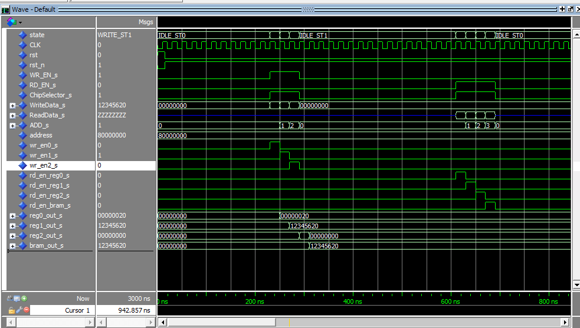
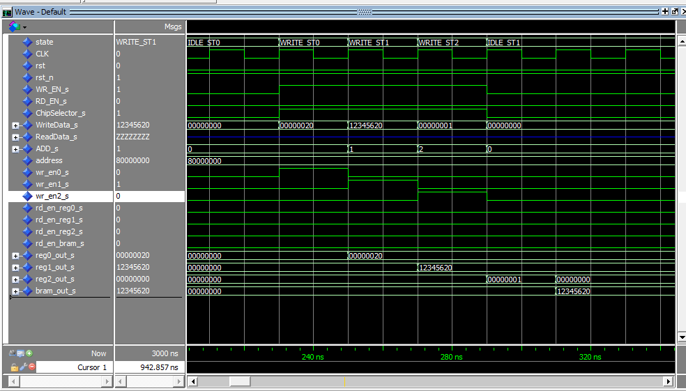
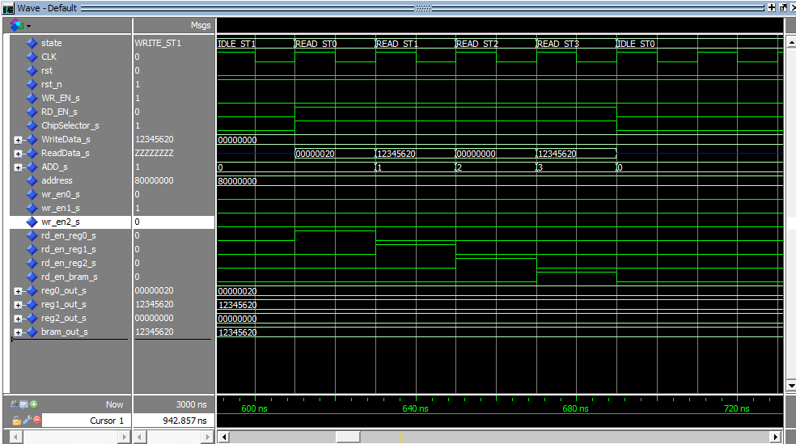

# Simulação do UserHW

* Overview geral da simulação: é escrito em ordem nos 3 registradores para posterior escrita na BRAM, além da leitura dos registradores e da BRAM.

* Escrita nos 3 registradores e na BRAM.

* Leitura dos 3 registradores e da BRAM.

